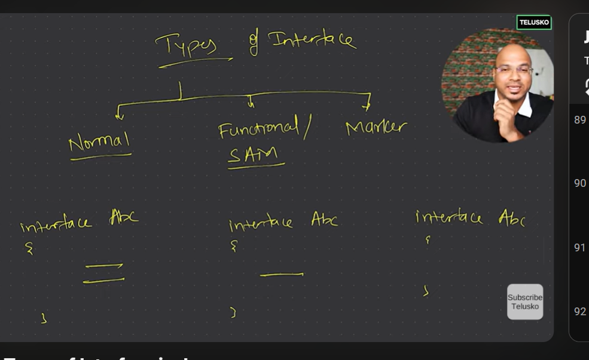
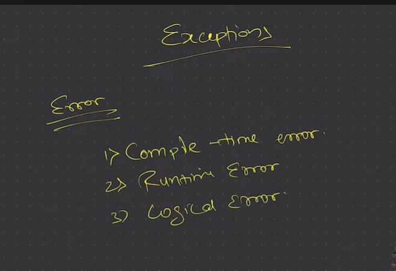
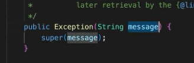
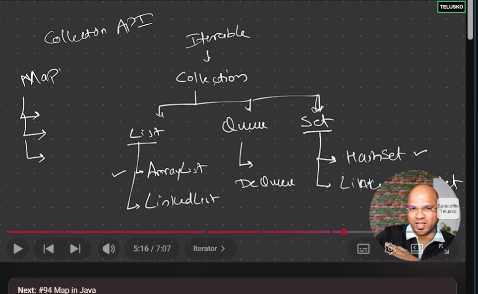

<!-- In abstract class we can create abstract methods as well as normal methods

Collection API -A concept

Collection -An Interface
Collections -A Class

int num =5;

int nums[] =new int[5]; -->

// Collection interface belongs to java.util package

        // Most of the classes belongs to java.lang package that's why we did not imported them

        //Collection is an interface so we cannot
        // create an object of that interface

        // All interfaces extends Collection interface 

        // :-List,Queue,Set

        // All these interfaces have their own class implementation

        // for eg;

        // For List we have -ArrayList

        // LinkedList

        // For Set-we have HashSet
        // Linked HashSet

        // For Queue-we have Dequeue

Errors and Exception

//Statements can be of two types

1.Normal Statement
2.Critical Statement

Even exception has a constructor which takes a string.

