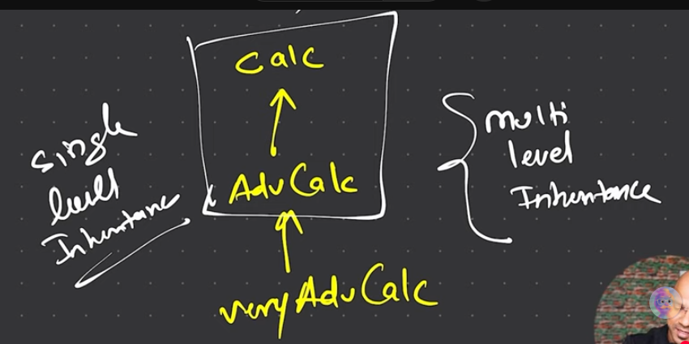
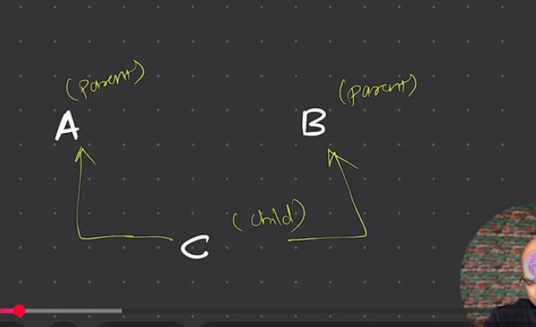
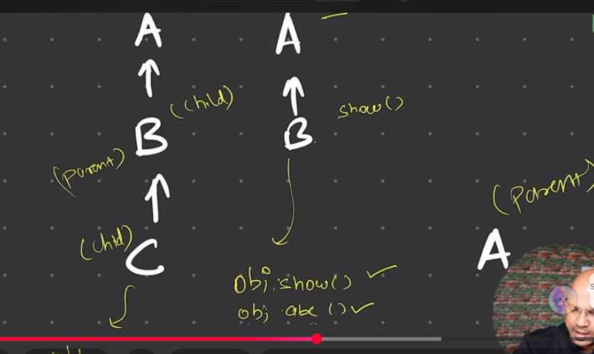

if you want something to be accessed  outside the package ,always make it public

private variable can be used in the same class irrespective of any package

you cannot have 2 public classes in the same file

one file one class(gneenral idea)

try to keep instance variable as private

the methods most of the time will be public
but if you think if there is a method or variable which should be accessed in a subclass of other packages ,use protected
try to avoid default.